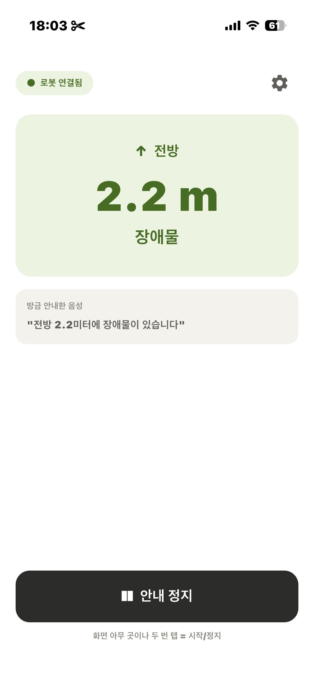

# limo-guide-app

안내 로봇 서버의 장애물 정보를 WebSocket으로 받아 한국어 TTS로 안내하는
Flutter iOS 앱. 연산은 전부 로봇 온보드 — 앱은 수신과 발화만 담당.

🤖 Server: [limo-fusion-guide](https://github.com/byulla/limo-fusion-guide)



## Features
- 화면·음성 동기화 (표시 내용 = 발화 내용)
- 변화 기반 즉시 발화 ("전방 1.2미터 가방" / "정지! 전방 사람!")
- 서버 주소·경고 거리 앱 내 설정

## Run
```bash
flutter pub get && flutter run
```
설정에서 `ws://<robot-ip>:8765` 입력 → "로봇 연결됨" 확인.

## Contributors

- 조예찬
- 조혜라
